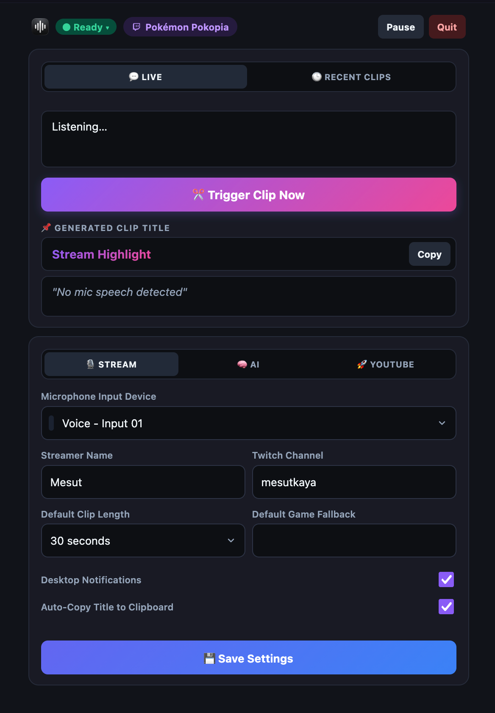

# Clip in Context

Rolling mic transcript backtrack, AI clip titler, and **AI Video Editor** for macOS streamers.

Press a button → your speech is transcribed locally (**MLX Whisper**), rewritten into a Twitch-style clip title (**Qwen 2.5 / Ollama**), automatically edited with **Karaoke-style dynamic subtitles (Spec v1)** and ending CTA cards, renamed, and uploaded as a YouTube Short. All 100% local on your Mac — no cloud cost, no per-clip fees.

```
mic → rolling audio buffer → (trigger) → MLX Whisper → Qwen 2.5 AI Title
    → Automatic Video Editor (Karaoke Captions + Story Splicing + End CTA)
    → Clipboard + Notification → Aitum → YouTube Shorts Upload
```



---

## 🌟 Key Features

* 🎬 **Automated AI Video Editor (`clip_editor.py`)**:
  * 🔤 **Karaoke Caption Style (Spec v1)**: **SF Pro Display Heavy (92px)** font, spoken sentence case, opaque black stroke, drop shadow, and clean lower-third placement (`center_y = 1300`).
  * 🎨 **Single Unified Phrase Colors**: Emotional beat color assigned per phrase (Red `#FF5A5A` for tension/fear, Green `#70E670` for payoff/success, Gold `#FFC93C` for neutral) with zero color mixing.
  * ✂️ **Smart Spoken Pause & Punctuation Chunking**: Automatically breaks text into new lines on natural pauses (`gap > 0.40s`) and sentence punctuation (`. ! ? ,`).
  * 📣 **Ending Creator CTA Cards**: Static `"LIVE MOST NIGHTS"` + `"follow for more!"` cards rendered in the final 2 seconds with speech captions automatically clearing out.
  * 🔒 **Sample-Accurate A/V Sync & Untouched Audio**: Input-first frame decoding seeking (`-i input.mp4 -ss ... -to ...`) with `-async 1`, `-avoid_negative_ts make_zero`, and 100% untouched raw audio quality (`-c:a copy`).
  * 🪝 **Hook Banner**: The title sits at the top for the first ~4.5s so scrollers know what's happening (`show_banner` in `config.json` to turn off).

* 📤 **Review Queue & Scheduled Publishing** (dashboard → Queue tab):
  * `/upload` during the stream only *records* the clip — no GPU editing or uplink use while live.
  * After the stream, **✨ Suggest titles** transcribes each exported clip (mic + game audio) and offers 3 title candidates. Pick or edit, then **Approve** or **Skip**.
  * Approved clips are edited with the final title and uploaded one at a time, scheduled to go public at the next free **Publish Time** (default 12:00 / 15:00 / 18:00 / 21:00).
  * The YouTube API allows ~6 uploads/day. Clips over the limit stay queued and retry after the midnight-Pacific reset; failures show a Retry button. Everything persists in `uploads.json`.
  * View counts refresh every 30 min; your best-performing titles become style examples for new ones.
  * Each uploaded Short links to YouTube Studio so you can set its **Related video** (the one clickable link a Short gets) — tick *done* when set.
  * Turn **Review Clips Before Upload** off in Settings → YouTube to edit and publish straight away, as before.

* #️⃣ **Game Hashtags**: `game_hashtags` in `config.json` maps Twitch categories (substring, longest match wins) to hashtags; unknown games get `#GameName`.

* 🎮 **Two Dedicated Clip Triggers**:
  1. ⚡ **Quick Short Trigger (20s–30s Replay)**:
     - `story_cut: False` — Keeps 100% of your raw video footage (no LLM cuts), burns Spec v1 Karaoke subtitles, adds ending CTA, and uploads.
     - Best for: Clutches, funny fails, single jumps, quick reactions.
  2. 🎬 **Long Story Cut Trigger (90s–120s Replay)**:
     - `story_cut: True` — Qwen 2.5 local AI model analyzes the transcript, finds the narrative arc (Hook ➔ Setup ➔ Climax), cuts filler dead air, and splices into a 25–40s Short.
     - Best for: Multi-minute boss fights, complex puzzle builds, side quests.

---

## 🚀 Requirements

- **Apple Silicon Mac** (MLX Whisper & Videotoolbox GPU acceleration).
- **[Ollama](https://ollama.com)**: `ollama serve` running with `qwen2.5:latest` (or `llama3.2`).
- Optional: OBS Studio, Aitum Nexus / Stream Deck / Hotkey triggers.

---

## 🛠️ Install

```bash
git clone https://github.com/iammesutkaya/Clip-in-Context.git
cd Clip-in-Context
./setup.sh
```

`setup.sh` creates a `.venv`, installs dependencies, registers an on-demand LaunchAgent, and builds **Clip in Context.app**.

---

## 🎮 HTTP Endpoints (Stream Deck / Aitum / Hotkeys)

All endpoints run on `http://localhost:5001`. Security validation enforces `Host: localhost` and blocks `cross-site` CSRF requests.

| Endpoint | Method | Description |
|---|---|---|
| `/clip?duration=30&game=X` | `GET` | Transcribe speech buffer ➔ generate AI title ➔ push to clipboard & Aitum. |
| `/edit?file=/path/to/clip.mp4&story_cut=false` | `GET` | **Quick Short Edit**: Renders full clip (no LLM cuts) with Spec v1 Karaoke subtitles & CTA card. |
| `/edit?file=/path/to/clip.mp4&story_cut=true` | `GET` | **AI Story Cut**: Analyzes story arc with Qwen 2.5, cuts filler, and renders edited Short. |
| `/name` | `GET` | Renames newest OBS video export to the generated AI title. |
| `/upload` | `GET` | Queues newest OBS export for review (or edits + uploads right away when review is off). |
| `/draw/request` | `GET` | Speed Draw: screens the viewer's request (word list, links, personal info, local AI check). Clean → starts the Aitum flow; flagged → held. |
| `/draw/approve`, `/draw/reject` | `GET` | Release or drop a held draw request (also in the menu bar). Rejected points are refunded in Twitch's reward queue. |
| `/pause`, `/resume` | `GET` | Pause / resume audio recording buffer. |
| `/quit` | `GET` | Stop the app. |

---

## 🧪 Tests & Audit

```bash
./.venv/bin/python3 test_logic.py   # Self-checks: transcript cleanup, ring buffer, metadata, scheduling, security sandboxes
```

---

## 📄 License
MIT — see [LICENSE](LICENSE).
